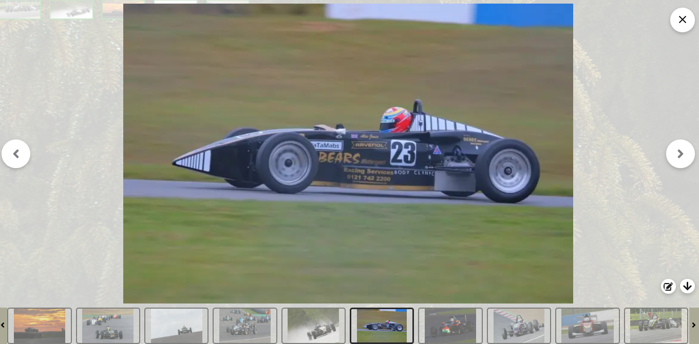

# Scrollable React Lightbox
A Scrollable image lightbox written in reactjs

### Demo


### Screenshot


## Run project
- `npm i && npm run dev`

### Setup
```js
import Mountain1 from "../public/mountain_1.jpg"
import Mountain2 from "../public/mountain_2.jpg"
import Mountain3 from "../public/mountain_3.jpg"
import Mountain4 from "../public/mountain_4.jpg"
import Mountain5 from "../public/mountain_5.jpg"

export default function Home(){
    const [images, setImages] = useState(null)

    function openLightbox(gallery) {
        setImages([
            {
                id: "askdiwo232938r2oi",
                text: "Mountain 1",
                image: Mountain1
            },
            {
                id: "2ir92193rj09123r9",
                text: "Mountain 2",
                image: Mountain2
            },
            {
                id: "kak6mr67oltowyq4tq4yw4i",
                text: "Mountain 3",
                image: Mountain3
            },
            {
                id: "1y6930sgxms;wpwuiw",
                text: "Mountain 4",
                image: Mountain4
            },
            {
                id: "1y840jbo;wpwuiw",
                text: "Mountain 5",
                image: Mountain5
            },
        ])
    }

    function closeLightbox() {
        setImages(null)
    }
    return (
        <div>
            {
                images && <Lightbox images={images} close={closeLightbox} />
            }
            <OtherComponents />
        </div>
    )
}
```